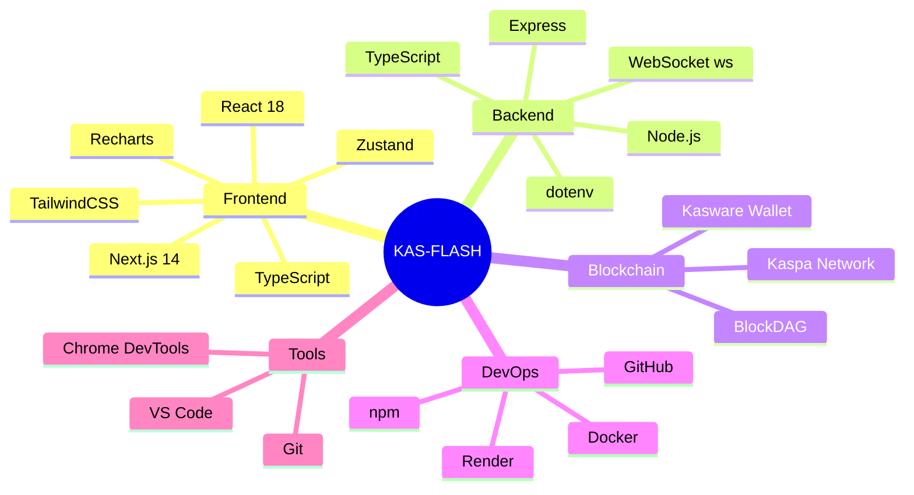

# KAS-FLASH Architecture Diagrams

## System Architecture Overview


## Component Architecture


## Data Flow Architecture


## Payment Processing Architecture


## Session Management Architecture


## State Management Architecture

```mermaid
graph TD
    subgraph "Zustand Stores"
        WalletStore[Wallet Store<br/>- connected<br/>- address<br/>- balance<br/>- role]
        StreamingStore[Streaming Store<br/>- session<br/>- transactions<br/>- isStreaming]
        MerchantStore[Merchant Stats Store<br/>- totalEarned<br/>- activeStreams<br/>- revenuePerSecond]
    end
    
    subgraph "Actions"
        WA[Wallet Actions<br/>- connect()<br/>- disconnect()<br/>- updateBalance()]
        SA[Streaming Actions<br/>- setSession()<br/>- addTransaction()<br/>- updateSession()]
        MA[Merchant Actions<br/>- updateStats()]
    end
    
    subgraph "Components"
        WC[WalletConnect]
        Player[StreamingPlayer]
        Dashboard[MerchantDashboard]
    end
    
    WalletStore --> WA
    StreamingStore --> SA
    MerchantStore --> MA
    
    WA --> WC
    SA --> Player
    MA --> Dashboard
    
    WC --> WalletStore
    Player --> StreamingStore
    Dashboard --> MerchantStore
    
    style WalletStore fill:#e1f5ff
    style StreamingStore fill:#e1ffe1
    style MerchantStore fill:#fff4e1
```

## API Architecture


## Security Architecture


## Deployment Architecture


## Technology Stack



## File Structure

```
KAS-FLASH/
├── frontend/
│   ├── src/
│   │   ├── app/
│   │   │   ├── layout.tsx          # Root layout
│   │   │   ├── page.tsx            # Main page
│   │   │   └── globals.css         # Global styles
│   │   ├── components/
│   │   │   ├── WalletConnect.tsx   # Wallet connection
│   │   │   ├── MoviesSection.tsx   # Video streaming
│   │   │   ├── APISection.tsx      # API services
│   │   │   ├── CloudSection.tsx    # Cloud services
│   │   │   ├── MerchantDashboard.tsx # Merchant stats
│   │   │   └── TransactionList.tsx # TX history
│   │   ├── hooks/
│   │   │   └── useWebSocket.ts     # WebSocket hook
│   │   ├── lib/
│   │   │   ├── api.ts              # API client
│   │   │   ├── kasware.ts          # Kasware integration
│   │   │   └── utils.ts            # Utilities
│   │   ├── store/
│   │   │   └── index.ts            # Zustand stores
│   │   └── data/
│   │       └── services.ts         # Service definitions
│   ├── public/                     # Static assets
│   ├── package.json
│   └── next.config.js
│
├── backend/
│   ├── src/
│   │   ├── index.ts                # Main server
│   │   ├── services/
│   │   │   ├── KaspaClient.ts      # Blockchain client
│   │   │   └── StreamingService.ts # Session manager
│   │   └── websocket/
│   │       └── server.ts           # WebSocket server
│   ├── package.json
│   └── tsconfig.json
│
├── shared/
│   ├── src/
│   │   ├── types.ts                # Shared types
│   │   └── constants.ts            # Constants
│   ├── package.json
│   └── tsconfig.json
│
├── docs/
│   ├── PROJECT_DESCRIPTION.md      # Project overview
│   ├── FLOWCHARTS.md               # System flowcharts
│   ├── ARCHITECTURE_DIAGRAMS.md    # This file
│   ├── DEPLOYMENT.md               # Deployment guide
│   ├── TROUBLESHOOTING.md          # Debug guide
│   └── KASWARE_TRANSACTION_GUIDE.md # TX guide
│
├── docker-compose.yml              # Docker config
├── render.yaml                     # Render config
└── package.json                    # Root package
```

---

## How to Use These Diagrams

### For Developers
- Understand system architecture before coding
- Reference during feature development
- Use for code reviews and discussions

### For Documentation
- Include in technical documentation
- Use in presentations and demos
- Share with team members

### For Debugging
- Trace data flow during issues
- Understand component interactions
- Identify bottlenecks

### For Planning
- Plan new features
- Identify refactoring opportunities
- Design system improvements

---

**These architecture diagrams provide a comprehensive visual guide to the KAS-FLASH system structure and design.**
