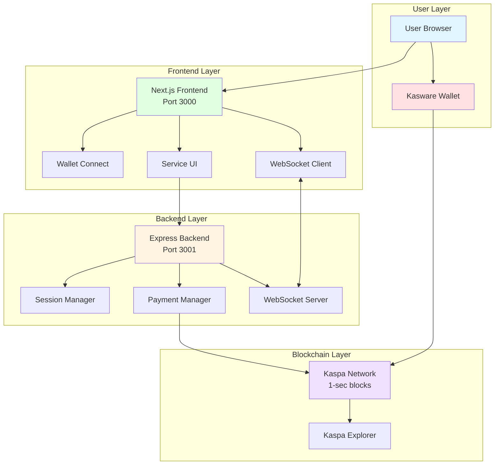
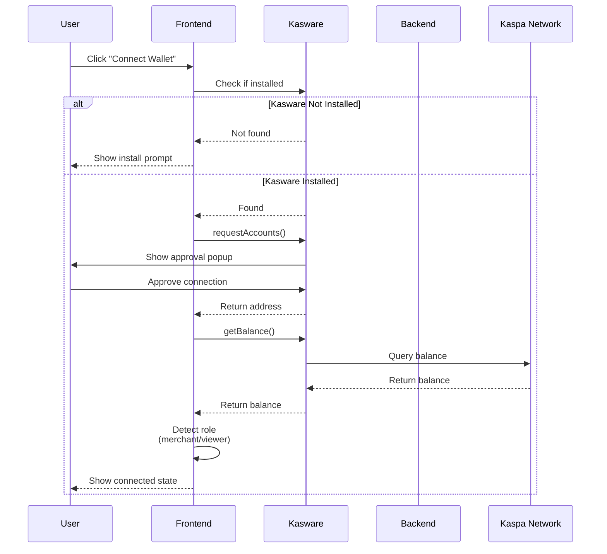
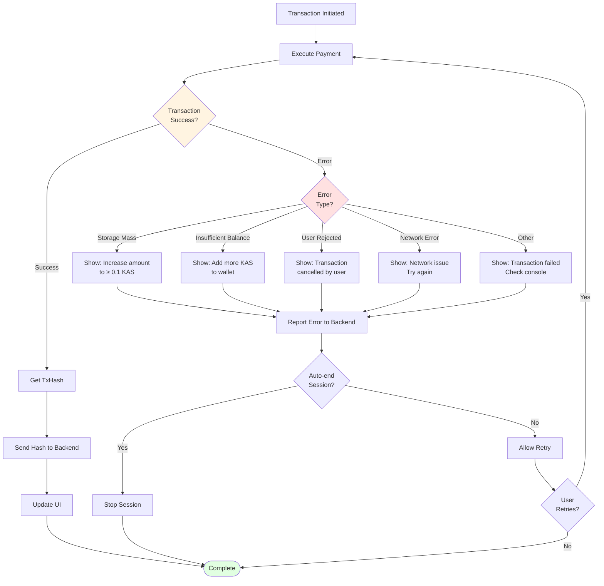
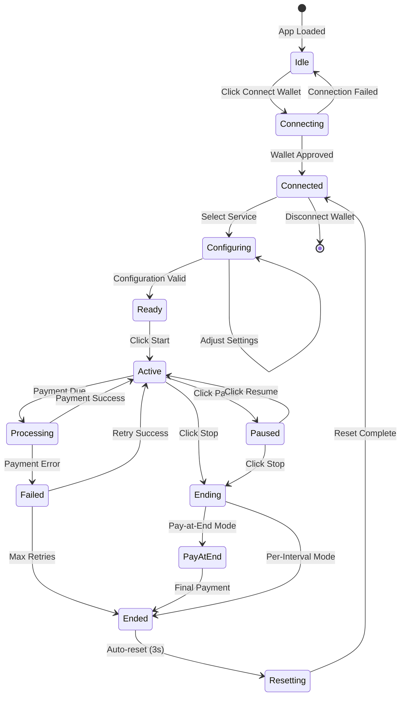
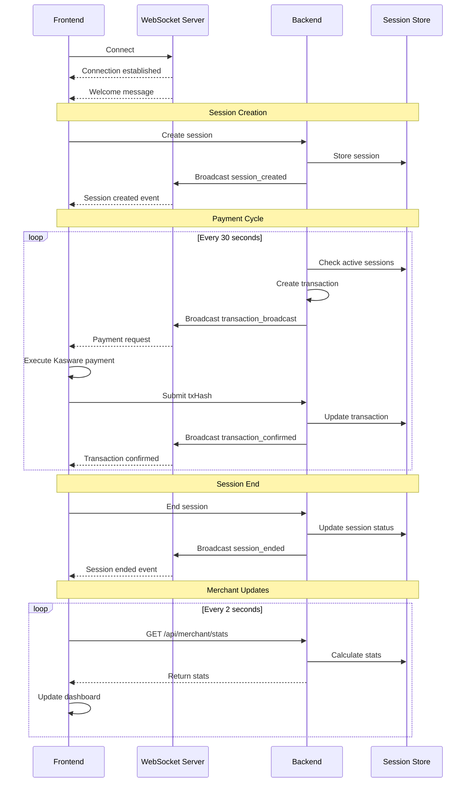
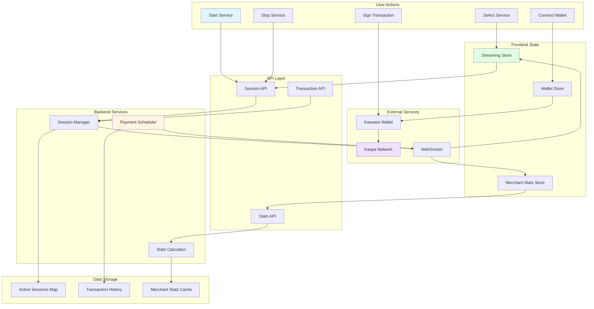
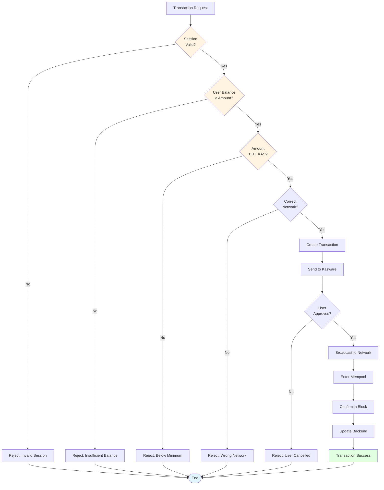
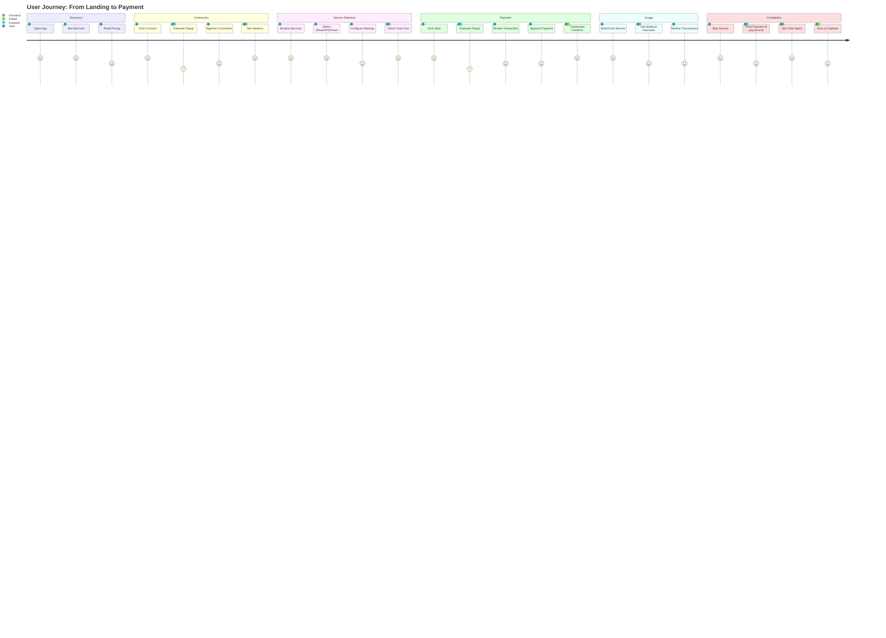

# KAS-FLASH System Flowcharts

## 1. Overall System Architecture



## 2. User Authentication Flow



## 3. Pay-Per-Interval Transaction Flow

```mermaid
sequenceDiagram
    participant U as User
    participant F as Frontend
    participant K as Kasware
    participant B as Backend
    participant WS as WebSocket
    participant KN as Kaspa Network
    
    U->>F: Select service & click "Start"
    F->>B: POST /api/sessions/create
    B->>B: Create session
    B->>WS: Broadcast session_created
    WS-->>F: Session created
    F-->>U: Show "Service Active"
    
    loop Every 30 seconds
        B->>B: Calculate payment amount
        B->>WS: Broadcast transaction_broadcast
        WS-->>F: Payment request
        F->>K: sendKaspa(merchant, amount)
        K->>U: Show transaction popup
        U->>K: Approve transaction
        K->>KN: Broadcast transaction
        KN-->>K: Return txHash
        K-->>F: Return txHash
        F->>B: POST /api/transactions/:id/hash
        B->>B: Update transaction
        B->>WS: Broadcast transaction_confirmed
        WS-->>F: Transaction confirmed
        F->>K: getBalance()
        K-->>F: New balance
        F-->>U: Update balance display
    end
    
    U->>F: Click "Stop"
    F->>B: POST /api/sessions/:id/end
    B->>B: End session
    B->>WS: Broadcast session_ended
    WS-->>F: Session ended
    F-->>U: Show "Service Stopped"

sequenceDiagram
    participant U as User
    participant F as Frontend
    participant K as Kasware
    participant B as Backend
    participant WS as WebSocket
    participant KN as Kaspa Network
    
    U->>F: Select "Pay at End" mode
    U->>F: Click "Start"
    F->>B: POST /api/sessions/create<br/>(payAtEnd: true)
    B->>B: Create session<br/>(no recurring payments)
    B->>WS: Broadcast session_created
    WS-->>F: Session created
    F-->>U: Show "Service Active"
    
    Note over U,F: User watches/uses service<br/>No payments during usage
    
    U->>F: Click "Stop" or video ends
    F->>B: POST /api/sessions/:id/end
    B->>B: Calculate total cost<br/>(duration × rate)
    B->>B: Create single transaction
    B->>WS: Broadcast transaction_broadcast
    WS-->>F: Payment request (full amount)
    F->>K: sendKaspa(merchant, totalAmount)
    K->>U: Show transaction popup
    U->>K: Approve transaction
    K->>KN: Broadcast transaction
    KN-->>K: Return txHash
    K-->>F: Return txHash
    F->>B: POST /api/transactions/:id/hash
    B->>B: Update transaction & end session
    B->>WS: Broadcast session_ended
    WS-->>F: Session ended
    F->>K: getBalance()
    K-->>F: New balance
    F-->>U: Show "Payment Complete"

graph TD
    Start([User Opens App]) --> Connect{Wallet<br/>Connected?}
    Connect -->|No| ShowConnect[Show Connect Button]
    ShowConnect --> ClickConnect[User Clicks Connect]
    ClickConnect --> Kasware[Kasware Popup]
    Kasware --> Approve{User<br/>Approves?}
    Approve -->|No| ShowConnect
    Approve -->|Yes| Connected[Wallet Connected]
    Connect -->|Yes| Connected
    
    Connected --> Role{Detect<br/>Role}
    Role -->|Merchant| MerchantDash[Show Merchant Dashboard]
    Role -->|Viewer| ViewerUI[Show Service Selection]
    
    ViewerUI --> SelectType{Select<br/>Service Type}
    SelectType -->|Movies| MovieConfig[Configure Movie Payment]
    SelectType -->|API| APIConfig[Configure API Requests]
    SelectType -->|Cloud| CloudConfig[Configure Cloud Time]
    
    MovieConfig --> PayMode{Payment<br/>Mode?}
    PayMode -->|Per Interval| SetInterval[Select Interval:<br/>Second/Minute/Hour]
    PayMode -->|Pay at End| PayEnd[Pay when done]
    
    APIConfig --> EnterQty[Enter Quantity<br/>Min: 1 request]
    CloudConfig --> EnterTime[Enter Duration<br/>Min: 1 minute]
    
    SetInterval --> CheckMin{Total Cost<br/>≥ 0.1 KAS?}
    PayEnd --> CheckMin
    EnterQty --> CheckMin
    EnterTime --> CheckMin
    
    CheckMin -->|No| ShowWarning[Show Warning:<br/>Increase amount]
    ShowWarning --> SelectType
    CheckMin -->|Yes| EnableStart[Enable Start Button]
    
    EnableStart --> ClickStart[User Clicks Start]
    ClickStart --> CreateSession[Create Session]
    CreateSession --> StartPayments[Begin Payment Flow]
    
    style Start fill:#e1f5ff
    style Connected fill:#e1ffe1
    style MerchantDash fill:#ffe1e1
    style StartPayments fill:#f0e1ff

graph LR
    subgraph "Data Sources"
        S1[Active Sessions]
        S2[Transaction History]
        S3[Payment Events]
    end
    
    subgraph "Backend Processing"
        SM[Session Manager]
        TM[Transaction Manager]
        SC[Stats Calculator]
    end
    
    subgraph "Real-time Updates"
        WS[WebSocket Server]
        Poll[Polling API<br/>Every 2 seconds]
    end
    
    subgraph "Frontend Display"
        TE[Total Earned]
        AS[Active Streams]
        RS[Revenue/Second]
        TT[Total Transactions]
        G1[Earnings Graph]
        G2[Revenue Rate Graph]
    end
    
    S1 --> SM
    S2 --> TM
    S3 --> SC
    
    SM --> SC
    TM --> SC
    
    SC --> WS
    SC --> Poll
    
    WS --> TE
    WS --> AS
    WS --> RS
    WS --> TT
    
    Poll --> TE
    Poll --> AS
    Poll --> RS
    Poll --> TT
    
    TE --> G1
    RS --> G2
    
    style WS fill:#ffe1e1
    style Poll fill:#fff4e1
    style G1 fill:#e1ffe1
    style G2 fill:#e1ffe1
```

## 7. Error Handling Flow



## 8. Session Lifecycle



## 9. WebSocket Communication Flow



## 10. Data Flow Architecture



## 11. Transaction Validation Flow



## 12. Complete User Journey Map



---

## How to View These Flowcharts

### Option 1: GitHub/GitLab
These Mermaid diagrams render automatically on GitHub and GitLab.

### Option 2: VS Code
Install the "Markdown Preview Mermaid Support" extension.

### Option 3: Online Viewers
- https://mermaid.live
- https://mermaid-js.github.io/mermaid-live-editor

### Option 4: Export as Images
Use Mermaid CLI to export as PNG/SVG:
```bash
npm install -g @mermaid-js/mermaid-cli
mmdc -i FLOWCHARTS.md -o flowcharts.png
```

---

**These flowcharts provide a complete visual understanding of the KAS-FLASH system architecture and user flows.**
