# 🖼️ How to Generate Flowchart Images

This guide shows you how to convert the Mermaid flowcharts in `FLOWCHARTS.md` into PNG/SVG images.

---

## Method 1: Online Converter (Easiest)

### Step 1: Open Mermaid Live Editor
Go to: https://mermaid.live

### Step 2: Copy Flowchart Code
1. Open `FLOWCHARTS.md`
2. Copy any flowchart code (between the ` ```mermaid ` markers)
3. Paste into the Mermaid Live Editor

### Step 3: Export Image
1. Click "Actions" button (top right)
2. Select "PNG" or "SVG"
3. Download the image
4. Rename to match the flowchart (e.g., `system-architecture.png`)

### Repeat for All Flowcharts
- Overall System Architecture → `01-system-architecture.png`
- User Authentication Flow → `02-authentication-flow.png`
- Pay-Per-Interval Flow → `03-pay-per-interval.png`
- Pay-At-End Flow → `04-pay-at-end.png`
- Service Selection Flow → `05-service-selection.png`
- Merchant Dashboard Flow → `06-merchant-dashboard.png`
- Error Handling Flow → `07-error-handling.png`
- Session Lifecycle → `08-session-lifecycle.png`
- WebSocket Communication → `09-websocket-communication.png`
- Data Flow Architecture → `10-data-flow.png`
- Transaction Validation → `11-transaction-validation.png`
- User Journey Map → `12-user-journey.png`

---

## Method 2: Mermaid CLI (Automated)

### Step 1: Install Mermaid CLI
```bash
npm install -g @mermaid-js/mermaid-cli
```

### Step 2: Create Individual Flowchart Files

Create a folder for flowcharts:
```bash
mkdir flowchart-images
cd flowchart-images
```

Create separate `.mmd` files for each flowchart:

**01-system-architecture.mmd:**

```mermaid
graph TB
    subgraph "User Layer"
        U[User Browser]
        K[Kasware Wallet]
    end
    
    subgraph "Frontend Layer"
        F[Next.js Frontend<br/>Port 3000]
        WC[Wallet Connect]
        UI[Service UI]
        WS1[WebSocket Client]
    end
    
    subgraph "Backend Layer"
        B[Express Backend<br/>Port 3001]
        SM[Session Manager]
        PM[Payment Manager]
        WS2[WebSocket Server]
    end
    
    subgraph "Blockchain Layer"
        KN[Kaspa Network<br/>1-sec blocks]
        EX[Kaspa Explorer]
    end
    
    U --> F
    U --> K
    F --> WC
    F --> UI
    F --> WS1
    WS1 <--> WS2
    UI --> B
    B --> SM
    B --> PM
    B --> WS2
    K --> KN
    PM --> KN
    KN --> EX
    
    style U fill:#000000
    style K fill:#ffe1e1
    style F fill:#e1ffe1
    style B fill:#fff4e1
    style KN fill:#f0e1ff
```


### Step 3: Generate Images
```bash
# Generate PNG (default)
mmdc -i 01-system-architecture.mmd -o 01-system-architecture.png

# Generate SVG (scalable)
mmdc -i 01-system-architecture.mmd -o 01-system-architecture.svg

# Generate with custom size
mmdc -i 01-system-architecture.mmd -o 01-system-architecture.png -w 1920 -h 1080

# Generate all at once
for file in *.mmd; do mmdc -i "$file" -o "${file%.mmd}.png"; done
```

### Step 4: Optimize Images (Optional)
```bash
# Install image optimizer
npm install -g imagemin-cli imagemin-pngquant

# Optimize PNGs
imagemin *.png --out-dir=optimized --plugin=pngquant
```

---

## Method 3: VS Code Extension

### Step 1: Install Extension
1. Open VS Code
2. Go to Extensions (Ctrl+Shift+X)
3. Search for "Markdown Preview Mermaid Support"
4. Install the extension

### Step 2: Preview Flowcharts
1. Open `FLOWCHARTS.md`
2. Press `Ctrl+Shift+V` (Preview)
3. Flowcharts render automatically

### Step 3: Export as Image
1. Right-click on rendered flowchart
2. Select "Save Image As..."
3. Save to your desired location

---

## Method 4: GitHub/GitLab (Automatic)

### GitHub
Mermaid diagrams render automatically on GitHub:
1. Push `FLOWCHARTS.md` to GitHub
2. View the file on GitHub
3. Flowcharts display automatically
4. Right-click → Save image

### GitLab
Same as GitHub - automatic rendering

---

## Method 5: Python Script (Batch Processing)

### Step 1: Install Dependencies
```bash
pip install mermaid-py
```

### Step 2: Create Script

**generate_flowcharts.py:**
```python
import os
import subprocess

# Read FLOWCHARTS.md
with open('FLOWCHARTS.md', 'r', encoding='utf-8') as f:
    content = f.read()

# Split by mermaid code blocks
blocks = content.split('```mermaid')

# Create output directory
os.makedirs('flowchart-images', exist_ok=True)

# Process each block
for i, block in enumerate(blocks[1:], 1):  # Skip first (before first mermaid block)
    # Extract mermaid code
    mermaid_code = block.split('```')[0].strip()
    
    # Save to temp file
    temp_file = f'temp_{i}.mmd'
    with open(temp_file, 'w', encoding='utf-8') as f:
        f.write(mermaid_code)
    
    # Generate image
    output_file = f'flowchart-images/{i:02d}-flowchart.png'
    subprocess.run(['mmdc', '-i', temp_file, '-o', output_file])
    
    # Clean up temp file
    os.remove(temp_file)
    
    print(f'Generated: {output_file}')

print('All flowcharts generated!')
```

### Step 3: Run Script
```bash
python generate_flowcharts.py
```

---

## Method 6: Docker (Isolated Environment)

### Step 1: Create Dockerfile

**Dockerfile:**
```dockerfile
FROM node:18-alpine

RUN npm install -g @mermaid-js/mermaid-cli

WORKDIR /app

COPY FLOWCHARTS.md .

CMD ["sh"]
```

### Step 2: Build and Run
```bash
# Build image
docker build -t mermaid-generator .

# Run container
docker run -it -v $(pwd)/flowchart-images:/app/output mermaid-generator

# Inside container, generate images
mmdc -i FLOWCHARTS.md -o output/flowcharts.png
```

---

## Recommended Workflow

### For Quick Preview
Use **Method 1** (Mermaid Live Editor) - fastest for single flowcharts

### For Documentation
Use **Method 2** (Mermaid CLI) - best for batch processing

### For Development
Use **Method 3** (VS Code Extension) - best for editing and previewing

### For Sharing
Use **Method 4** (GitHub) - automatic rendering, no setup needed

---

## Image Specifications

### Recommended Settings
- **Format:** PNG for documents, SVG for web
- **Resolution:** 1920x1080 or higher
- **DPI:** 300 for print, 72 for web
- **Background:** Transparent or white
- **Colors:** Use theme colors from flowcharts

### File Naming Convention
```
01-system-architecture.png
02-authentication-flow.png
03-pay-per-interval.png
04-pay-at-end.png
05-service-selection.png
06-merchant-dashboard.png
07-error-handling.png
08-session-lifecycle.png
09-websocket-communication.png
10-data-flow.png
11-transaction-validation.png
12-user-journey.png
```

---

## Embedding Images in Documentation

### Markdown
```markdown

```

### HTML
```html

```

### README
```markdown
## Architecture


For detailed flowcharts, see [FLOWCHARTS.md](FLOWCHARTS.md)
```

---

## Troubleshooting

### Issue: Mermaid CLI not found
**Solution:**
```bash
npm install -g @mermaid-js/mermaid-cli
# Or use npx
npx -p @mermaid-js/mermaid-cli mmdc -i input.mmd -o output.png
```

### Issue: Puppeteer errors
**Solution:**
```bash
# Install Chromium dependencies (Linux)
sudo apt-get install -y libgbm-dev

# Or use Docker method
```

### Issue: Images too small
**Solution:**
```bash
mmdc -i input.mmd -o output.png -w 2400 -h 1600
```

### Issue: Text cut off
**Solution:**
Add padding in mermaid config:
```bash
mmdc -i input.mmd -o output.png -c config.json
```

**config.json:**
```json
{
  "theme": "default",
  "themeVariables": {
    "fontSize": "16px"
  },
  "flowchart": {
    "padding": 20
  }
}
```

---

## Quick Start (Recommended)

### For Beginners
1. Go to https://mermaid.live
2. Copy flowchart code from `FLOWCHARTS.md`
3. Paste and export as PNG
4. Done!

### For Developers
```bash
# Install CLI
npm install -g @mermaid-js/mermaid-cli

# Generate all flowcharts
cd flowchart-images
# Copy each mermaid block to separate .mmd files
mmdc -i 01-system-architecture.mmd -o 01-system-architecture.png
# Repeat for all flowcharts
```

---

## Resources

- **Mermaid Live Editor:** https://mermaid.live
- **Mermaid Documentation:** https://mermaid-js.github.io
- **Mermaid CLI:** https://github.com/mermaid-js/mermaid-cli
- **VS Code Extension:** Search "Markdown Preview Mermaid Support"

---

**Now you can generate beautiful flowchart images for your documentation!** 🎨✨
