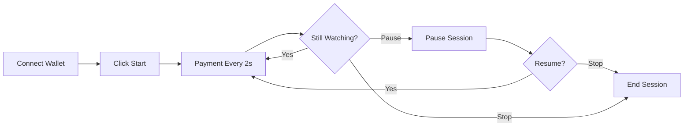

# KAS-FLASH: Real-Time Micropayment Streaming Platform

<div align="center">


**Stream content. Pay per second. Powered by Kaspa.**

[Live Demo](#) • [Documentation](#features) • [Get Started](#quick-start)

</div>

---

## 🚀 What is KAS-FLASH?

KAS-FLASH is the world's first **true micropayment streaming platform** that enables **real-time, per-second payments** for content consumption. Unlike traditional platforms that batch payments, KAS-FLASH leverages Kaspa's revolutionary 1-second block time to create a seamless pay-as-you-watch experience.

### Why Kaspa?

- **⚡ 1-Second Block Time**: Near-instant transaction confirmations
- **💰 Low Fees**: Makes micropayments economically viable
- **📈 High Throughput**: Handles multiple transactions per second
- **🔒 UTXO Model**: Better security and parallelization

---

## ✨ Features

### For Viewers

- 🎥 **Stream Premium Content** - Watch videos and pay only for what you consume
- ⏱️ **Per-Second Billing** - Transparent pricing at 0.001 KAS/second
- 💳 **Wallet Integration** - Seamless Kasware wallet connection
- 📊 **Live Dashboard** - Real-time balance, transactions, and payment flow
- ⏯️ **Full Control** - Pause, resume, or stop streaming anytime
- 📈 **Visual Analytics** - Interactive charts showing your payment history

### For Merchants

- 💵 **Real-Time Revenue** - Watch earnings update every second
- 👥 **Active Streams Monitor** - See how many viewers are watching
- 📊 **Revenue Analytics** - Track revenue per second and total earnings
- 📜 **Transaction History** - Complete log of all payments
- 🔄 **Auto-Updates** - Dashboard refreshes every 2 seconds

---

## 🎯 How It Works

### User Flow



### Technical Flow

1. **User Connects** → Kasware wallet connects to app
2. **Session Starts** → Backend creates streaming session
3. **Payment Cycle** → Every 2 seconds:
   - Frontend signs transaction
   - Backend broadcasts to Kaspa network
   - Transaction appears in mempool → Confirmed in ~1 second
   - WebSocket updates both dashboards
4. **Real-Time Updates** → Balance decreases, earnings increase
5. **Session Ends** → Final settlement, complete history

---

## 🏗️ Architecture

```
KAS-FLASH/
├── frontend/          # Next.js 14 + TypeScript
│   ├── components/    # UI components
│   ├── store/         # Zustand state management
│   ├── hooks/         # Custom hooks (WebSocket)
│   └── lib/           # API client & utilities
├── backend/           # Express + TypeScript
│   ├── services/      # Kaspa client, streaming engine
│   ├── websocket/     # Real-time communication
│   └── index.ts       # Main server
└── shared/            # Shared types & constants
```

### Technology Stack

**Frontend**
- Next.js 14 (App Router)
- TypeScript
- TailwindCSS
- Zustand (State Management)
- Recharts (Data Visualization)
- WebSocket Client

**Backend**
- Node.js + Express
- TypeScript
- WebSocket Server
- Kaspa RPC Client

**Blockchain**
- Kaspa Testnet
- Kasware Wallet

---

<a name="quick-start"></a>
## 🚀 Quick Start

### Prerequisites

- Node.js 18+ and npm
- [Kasware Wallet Extension](https://kasware.xyz)
- Kaspa Testnet tokens (from faucet)

### Installation

```bash
# Clone the repository
git clone <your-repo-url>
cd KasFlash

# Install dependencies for all workspaces
npm install

# Build shared package
cd shared && npm run build && cd ..

# Copy environment files
cp backend/.env.example backend/.env
cp frontend/.env.local frontend/.env.local

# Update backend/.env with your merchant address
# MERCHANT_ADDRESS=your_kaspa_testnet_address

# Start development servers (both frontend and backend)
npm run dev
```

### Access the App

- **Frontend**: http://localhost:3000
- **Backend API**: http://localhost:3001
- **WebSocket**: ws://localhost:3001

---

## 📖 Usage Guide

### As a Viewer

1. **Install Kasware**
   - Download from [kasware.xyz](https://kasware.xyz)
   - Create or import a wallet
   - Switch to Testnet

2. **Get Test KAS**
   - Visit Kaspa testnet faucet
   - Request test tokens
   - Wait for confirmation

3. **Start Streaming**
   - Open http://localhost:3000
   - Click "Connect Wallet"
   - Approve connection in Kasware
   - Click "Start Streaming"
   - Watch your balance decrease in real-time!

4. **Monitor Payments**
   - View live transaction list
   - See payment flow chart
   - Check total paid and transaction count

5. **Control Streaming**
   - **Pause**: Temporarily stop payments
   - **Resume**: Continue from where you paused
   - **Stop**: End session completely

### As a Merchant

1. **Toggle to Merchant View**
   - Click the "Merchant" button in the header

2. **Monitor Dashboard**
   - **Total Earned**: Cumulative earnings
   - **Active Streams**: Current viewer count
   - **Revenue/Second**: Real-time income rate
   - **Total Transactions**: Payment count

3. **Real-Time Updates**
   - Dashboard auto-refreshes every 2 seconds
   - Watch earnings tick up as viewers stream

---

## 🔧 Configuration

### Environment Variables

**Backend** (`backend/.env`):
```env
PORT=3001
KASPA_RPC_URL=https://api.kaspa.org
KASPA_NETWORK=testnet
MERCHANT_ADDRESS=kaspatest:your_address_here
TRANSACTION_FEE=0.0001
```

**Frontend** (`frontend/.env.local`):
```env
NEXT_PUBLIC_API_URL=http://localhost:3001
NEXT_PUBLIC_WS_URL=ws://localhost:3001
NEXT_PUBLIC_MERCHANT_ADDRESS=kaspatest:your_address_here
```

### Customize Rates

Edit `shared/src/constants.ts`:
```typescript
export const DEFAULT_RATE_PER_SECOND = 0.001; // Change rate
export const TRANSACTION_INTERVAL = 2000;      // Change frequency (ms)
```

---

## 🧪 Testing

### Local Development

```bash
# Terminal 1: Start backend
cd backend
npm run dev

# Terminal 2: Start frontend
cd frontend
npm run dev

# Terminal 3: Watch shared package
cd shared
npm run watch
```

### Verify Transactions

1. Start a streaming session
2. Check the transaction list in the UI
3. Copy a transaction hash
4. Visit https://explorer.kaspa.org/txs/{hash}
5. Verify on testnet explorer

---

## 🌟 Key Features Explained

### Real-Time Payments

Every **2 seconds**, a payment transaction is created and broadcast to the Kaspa network:
- Amount: `ratePerSecond * 2` (default: 0.002 KAS)
- Mempool detection: ~500ms
- Confirmation: ~1 second (Kaspa's block time)

### WebSocket Updates

Real-time events broadcast to all connected clients:
- `session_updated`: Status changes (active/paused/ended)
- `transaction_broadcast`: New payment created
- `transaction_mempool`: Transaction detected in mempool
- `transaction_confirmed`: Transaction confirmed on-chain
- `balance_updated`: Balance changes

### Auto-Stop on Low Balance

If viewer balance falls below `MIN_BALANCE_THRESHOLD` (0.01 KAS), the session automatically ends to prevent failed transactions.

---

## 🛠️ Development

### Project Structure

```
frontend/src/
├── app/
│   ├── layout.tsx           # Root layout
│   ├── page.tsx             # Main page (viewer/merchant toggle)
│   └── globals.css          # Global styles
├── components/
│   ├── WalletConnect.tsx    # Wallet connection UI
│   ├── StreamingPlayer.tsx  # Video player & controls
│   ├── TransactionList.tsx  # Transaction history
│   ├── BalanceChart.tsx     # Payment flow chart
│   └── MerchantDashboard.tsx # Merchant stats
├── store/
│   └── index.ts             # Zustand stores
├── hooks/
│   └── useWebSocket.ts      # WebSocket hook
└── lib/
    ├── api.ts               # API client
    └── utils.ts             # Utilities

backend/src/
├── services/
│   ├── KaspaClient.ts       # Blockchain interaction
│   └── StreamingService.ts  # Session management
├── websocket/
│   └── server.ts            # WebSocket server
└── index.ts                 # Express server
```

### Adding Features

1. **New Payment Rates**: Edit `shared/src/constants.ts`
2. **New UI Components**: Add to `frontend/src/components/`
3. **New API Endpoints**: Add to `backend/src/index.ts`
4. **New WebSocket Events**: Update `shared/src/types.ts`

---

## 📝 API Reference

### REST Endpoints

#### POST `/api/sessions/create`
Create a new streaming session
```json
{
  "viewerAddress": "kaspatest:...",
  "merchantAddress": "kaspatest:...",
  "ratePerSecond": 0.001
}
```

#### POST `/api/sessions/:id/pause`
Pause an active session

#### POST `/api/sessions/:id/resume`
Resume a paused session

#### POST `/api/sessions/:id/end`
End a streaming session

#### GET `/api/sessions/:id`
Get session details and transactions

#### GET `/api/merchant/stats`
Get merchant dashboard statistics

### WebSocket Events

**Client → Server**
- Connection established

**Server → Client**
- `session_created`: WebSocket connected
- `session_updated`: Session status changed
- `transaction_broadcast`: New transaction
- `transaction_mempool`: Transaction in mempool
- `transaction_confirmed`: Transaction confirmed
- `balance_updated`: Balance changed
- `error`: Error occurred

---

## 🚨 Important Notes

### Testnet Usage

This implementation uses **Kaspa Testnet**. Before deploying to mainnet:

1. Update RPC endpoints
2. Switch network in wallet
3. Audit smart contract logic
4. Test thoroughly
5. Implement proper security measures

### Kasware Integration

The wallet integration is currently **mock implementation** for the Kasware API. In production:

1. Use actual Kasware SDK
2. Implement proper transaction signing
3. Handle all error cases
4. Add network detection
5. Implement account change listeners

### Security Considerations

- ✅ No private keys stored server-side
- ✅ Client-side transaction signing
- ✅ Backend transaction verification
- ⚠️ Add rate limiting in production
- ⚠️ Implement session authentication
- ⚠️ Add CORS restrictions
- ⚠️ Sanitize all inputs

---

## 🤝 Contributing

Contributions are welcome! Please follow these steps:

1. Fork the repository
2. Create a feature branch (`git checkout -b feature/amazing-feature`)
3. Commit your changes (`git commit -m 'Add amazing feature'`)
4. Push to the branch (`git push origin feature/amazing-feature`)
5. Open a Pull Request

---

## 📄 License

This project is licensed under the MIT License - see the LICENSE file for details.

---

## 🙏 Acknowledgments

- **Kaspa Community** for the amazing blockchain
- **Kasware Team** for the wallet infrastructure
- **Next.js Team** for the excellent framework

---

## 📞 Support

- **Issues**: [GitHub Issues](your-repo-url/issues)
- **Kaspa Discord**: [Join Discord](https://discord.gg/kaspa)
- **Documentation**: [Kaspa Docs](https://kaspa.org)

---

<div align="center">

**Made with ⚡ by the Kaspa Community**

[⬆ Back to Top](#kas-flash-real-time-micropayment-streaming-platform)

</div>
